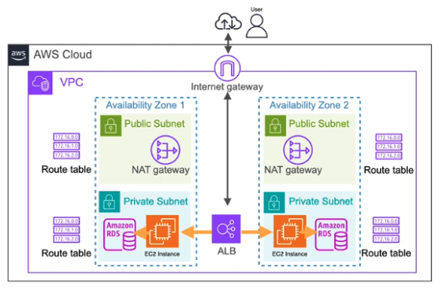

# Coursera Data Enginnering Certificate Notes

- Coursera website: [DeepLearning.AI Data Engineering Professional Certificate](https://www.coursera.org/professional-certificates/data-engineering)
- Official notes: [link](https://www.redpanda.com/guides/fundamentals-of-data-engineering)

## Source System

- data types: structured, semi-structured (e.g. JSON), unstructured data (e.g. file, video, audio, image)
- system types: database (relational/no-SQL db), object storage (e.g. files), streaming system

    - Relational db (Amazon RDS)
    
        - data normalization: minimize redundancy, ensure data integrity, but slow to query the data

    - no-SQL db (Dynamodb)
    
        - not only SQL
        - flexible schema (maintenance overhead), good at horizontal scaling (eventual consistency)
        - perfect for applications where system availability and scalability is more important than real time consistency, such as social media platforms or content distribution networks
        - not all supports ACID (mongo db does), don’t support joins

    - Online transaction processing (OLTP) system
        
        - e.g. banking, finance and ecommerce
        - ACID compliant (strong consistency)
        
            - Atomicity: transactions are atomic (operations under a txn are all or none executed successfully)
            - Consistency: any changes to the data made within a transaction must follow the set of rules or constraints defined by the database schema (not the same as db consistency). Make sure db under transition always under valid state
            - Isolation: difference concurrent transactions will be executed individually in sequence
            - Durability: once a transaction is completed, its effects are permanent and will survive any subsequent system failures, such as a power loss (reliability, replication)
        
        - Most relational db + some no-SQL db
        - Relaxing one or more of these constraints, you can improve certain aspects of the databases performance and make it more scalable

    - object storage (Amazon S3)
    
        - no hierarchy 
        - objects: CSV, JSON, text, video, audio, image, binary data, each is associated with an Universal Unique Identifier, or UUID
        - immutable (rewrite full object and update UUID, object versioning)
        - easy to scale out, vertical scaling (replication)

    - batch system (ETL -> ELT)
        
        - Cloud data warehouse reduced the cost of storing and processing data power significantly
        - data volume explodes
        - faster to implement, make data available more quickly, later to decide how to transform; but may lead to unorganized, unmanageable, useless data swamp

    - streaming system (Amazon Kinesis, Kafka)

        - producer, broker (topic, partition/stream, shard), consumer
        - message queue vs streaming platform
        
            - message queue: FIFO, message is eventually deleted, temporary storage (Amazon simple queue service, SQS)
            - streaming platform: write stream to a append only log, data is persistent, can replay/reprocess events

        - change data capture (CDC)
        
            - Extracts each change event (insert, update, delete) that occurs in a "database” and makes it available for downstream systems
            - push (data loss if target system is unreachable, performance issue if too frequent. e.g. trigger) vs pull (data update lag. e.g. run query on table and filter by timestamp (computational overhead or extra column to store), read events from db log)

## Networking

- VPC (virtual private cloud)

    - all availability zones (AZs) in one VPC should be in the same region, within one VPC all resources can be configured
    - ip address [0-255] (8 bit).[0-255].[0-255].[0-255]/16 (first two as the network prefix, the rest are host addresses)

- Subnets

    - must associate to an AZ
    - private/public

- gateway

    - internet gateway
    
        - interact with user via requests/responses
        - inbound and outbound via ALB (application load balancer)

    - NAT gateway (network address translation)
        
        - applications on EC2 need download updates from internet (upgrades, patching)
        - outbound traffic only

- route table

    - direct network traffic within the VPC
    - one per subnet
    - public: all traffics -> internet gateway
    - private: all traffics -> NAT gateway

- security

    - security groups
        
        - virtual firewalls at instance level (e.g. ALB, EC2, RDS)
        - stateful: allowing inbound traffic from inbound rules to an instance automatically allows the return traffic

    - network ACLs (access control lists)
    
        - subnet level, more granular control
        stateless: need to explicitly define both inbound and outbound rules

## Devops/Data ops (data check vs software application check)

- automation: continuous integration and continuous delivery (CICD)

    - build, test, integrate, deploy
    - version control
    - infrastructure as code: automate resource creation for data pipelines, including networking, security, computing, storage, analytics, etc (e.g. AWS cloudformation, terraform)

- observability and monitoring

    - high quality of data: accurate, complete, discoverable available in a timely manner, well-defined schema
    - the ability to understand the health of the system
    - key metrics: uptime (number of incidents), time to detection, resolution (time to resolve), freshness, volume, accuracy
    - Amazon cloudwatch
    
        - system level metrics: cpu utilization, disk space, network traffic, memory usage, database connection
        - data quality custom metrics
        - set up alerts
        - data retention

## Data Orchestration

- before: cronjob for each step, pure scheduling approach
- orchestration:

    - pros: manage dependencies (wait for prev jobs to finish and start the next), monitor tasks, get alerts, create fallback plans, debugging
    - cons: more operational overhead, cronjob is good for simple pipelines, or prototyping phase
    - direct acyclic graph (DAG)

- Apache Airflow

    - traditional paradigm

        - organize DAG with operator for each task
        - PhythonOperator, BashOperator, EmptyOperator, EmailOperator, Sensor
        - define dependency: >>, []

    - airflow 2.0 TaskFlow API
    
        - easier to write and concise with Python decorators
        - with DAG(...) -> @dag(...), @task
        - branching: dynamically direct task flow, deciding which subsequent task to execute next based on a specified condition

- Apache Airflow on AWS

    - run open-source version of airflow on EC2: more control, more management
    - Amazon Managed Workflows for Apache Airflow (MWAA): offers flexibility, good for complex workflows
    - AWS Glue workflow: create, run, monitor complex ETL workflow
    - AWS Step Functions: orchestrate multiple AWS services and states into workflows called state machines. Provide serverless options, ideal for AWS centric workflows

## Data Storage

- storage hierarchy

    - raw ingredients

        - physical components
        
            - persistent storage: magnetic disk (HDD, higher latency due to seek time + rotational latency, but cheaper), solid state drives (SSD)
            - volatile: memory, CPU cache (in CPU processing chip)

            |                                           | Magnetic Disk | SSD      | RAM      | CPU cache |
            |-------------------------------------------|---------------|----------|----------|-----------|
            | Latency                                   | 4 ms          | 0.1 ms   | 0.1 us   | 1 ns      |
            | IOPS (input/output operations per second) | 100x          | 10k x    | 1m x     | /         |
            | Data transfer speed                       | 300 mb/s      | 4 gb/s   | 100 gb/s | 1 tb/s    |
            | Cost                                      | $0.05 /gb     | $0.1 /gb | $3 /gb   | /         |

        
        - process to store transmit data
        
            - networking: distributed system
            - serialization: different formats (human readable csv/json vs binary), row based for OLTP, column based for OLAP
            - compression: re-code the data in a more efficient way

    - storage system

        - block storage
        
            - performance and flexibility for OLTP
            - small, fixed size blocks on magnetic disks or SSD
            - easy to make changes without updating the whole structure, good performance for frequently read/write operations
            - Amazon elastic block store (EBS)
            
        - file storage
        
            - Amazon elastic file system (EFS)
            - built on top of block storage
            - need to track file hierarchy, less read and write performance

        - object storage
        
            - decouple storage layer to compute layer
            - large storage space, can scale on demand
            - offer high scalability and parallel data processing
            - immutable object, need to make entire change for updates, not good for transactional workloads (OLTP)
            - good as storage layer for cloud data warehouse/data lake /OLAP/machine learning pipeline
            - Amazon s3 bucket

    - storage tiers

    |                  | hot storage                        | warm storage                 | cold storage           |
    |------------------|------------------------------------|------------------------------|------------------------|
    | access frequency | very frequent                      | less frequent                | infrequent             |
    | example          | product recommendation application | regular reports and analysis | archive                |
    | storage medium   | SSD, memory                        | magnetic disk/hybrid         | low cost magnetic disk |
    | storage cost     | high                               | medium                       | low                    |
    | retrieval cost   | low                                | medium                       | high                   |

    - distributed storage system

        - server (magnetic disk/ssd) -> node -> cluster -> system
        - horizontal scaling: more capacity, better fault tolerance and data durability, higher availability
        - better performance from parallel processing, serve requests from the nearest/least congested nodes
        - distribute data
            
            - replication
            - partitioning
            
                - sharding methods: range-based (may be unbalanced), hash based, geo sharding
            - combination

        - CAP theorem
        
            - replication takes time: either wait till updated, or directly get a “recent” one
            - Any distributed system can only guarantee two out of three properties
            
                - Consistency: every read reflects the latest write operation
                - Availability: every request will receive a response, even if it's not necessarily the most recent data
                - Partition-tolerance: the system continues to function even when the network experiences disruptions or failures that isolate some nodes from others (usually given)

            - ACID compliant RDBMS chooses consistency over availability
            
                - atomic, consistent, isolation, durability
                
            - BASE No-SQL db usually chooses availability over consistency (or read replica from RDBMS)
            
                - basically available, soft-state, eventual consistency

    - storage abstractions: data warehouse, data lake, data lakehouse
    
        - data warehouse: query structured data for analytical/reporting purpose
        
            - properties
            
                - subject-oriented: organize and store data around key business domains
                - integrated: combine data from different formats into a consistent format
                - nonvolatile: data is read-only and cannot be deleted/updated
                - time-variant: store current and historical data (unlike OLTP)

            - data source (CDC) -> ETL -> data warehouse
            - data mart: subset of data warehouse, serve for specific needs of a business function (sales/marketing/finance)
            - modern cloud data warehouse
            
                - high computing power: spin up compute cluster on demand
                - columnar storage
                - separation of compute and storage (object storage is limitless)

        - data lake: query unstructured data for machine learning/exploratory analysis (aws glue + s3)
        
            - central repo for structured and unstructured data (json, text, video, audio files)
            - schema on read pattern (reader determines the schema and what to read)
            - storage: hadoop -> object storage (e.g. s3)
            - processing (transform/read): mapreduce,  apache pig, spark, hive
            - data lake 1.0 (data swamp): no data cataloging and data discovery tools, not guarantee on data quality/integrity, write only
            - next-gen data lakes
            
                - data zone: raw zone, cleaned/transformed zone, curated/enriched zone (open file format). better data governance
                - data partitioning: only query relevant data, faster query performance
                - data catalog: better data discovery. Collection of metadata (owner, source, partitioning info, column info, schema, etc)

        - data lakehouse (AWS lake formation)
        
            - separate data lakes and data warehouse
            
                - data source -> ETL (data lake, low cost storage -subset of data-> data warehouse, high query performance) -> analytics
                - expensive solution: introduce bugs/failures, cause issues with data quality, duplication, consistency

            - storage format: open table format
            
                - snapshots + changes
                - schema and partition evolution
                - support query engine to access the data

            - data source + data ingestion + storage + processing (ETL) + catalog (metadata, data discovery) + consumption (data visualization/query/analysis)

## Database

- DBMS
- relational, graph, vector
- in-memory storage system: memcached (key-value store), redis (key-value store that supports more complex data types, high performance with tolerance on small data loss)
- store structured tabular data

    - row-oriented storage
    
        - consecutive sequence of bytes on disk
        - OLTP system

    - column-oriented storage
    
        - no-SQL db
        - good for analytical queries, OLAP system

    - hybrid
    
        - parquet: row group + column chucks + data pages (metadata + encoded values)
        - wide-column database: two dimensional key-value map. row key -> column (column key -> column value)

- vector database: efficient query of data based on semantic similarities by storing and processing vector embeddings
- graph database
